# Architecture

Engineering reference for the Plume Nexus / Meraki Salon Manager stack as of 2026-05-10. This is a working document — update it when the architecture meaningfully changes. For per-module file maps and feature lists, see [`CLAUDE.md`](./CLAUDE.md).

---

## System overview

The stack splits into three layers — clients, our Firebase backend, and third-party services. The three diagrams below show each layer and its links to the others. GitHub's Mermaid renderer fits each diagram cleanly; for a single zoomable view of all three together, see the dedicated "Pretty" diagram (Eraser.io / Figma) when one exists.

### Layer 1 — Client surfaces → Firebase

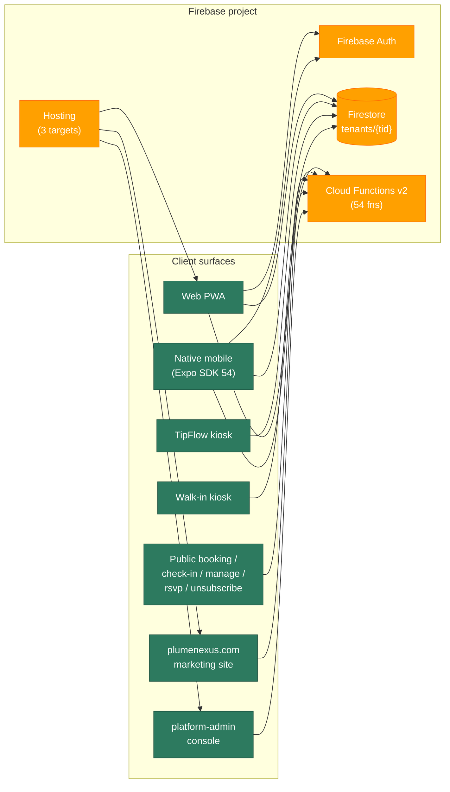

### Layer 2 — Cloud Functions → third-party services

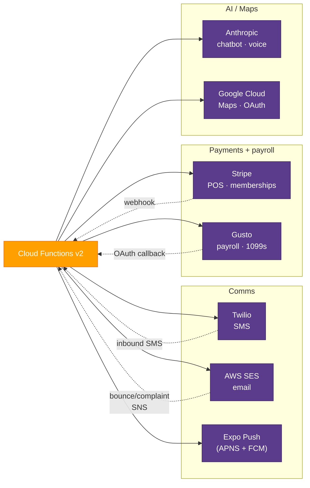

### Layer 3 — Edge + distribution

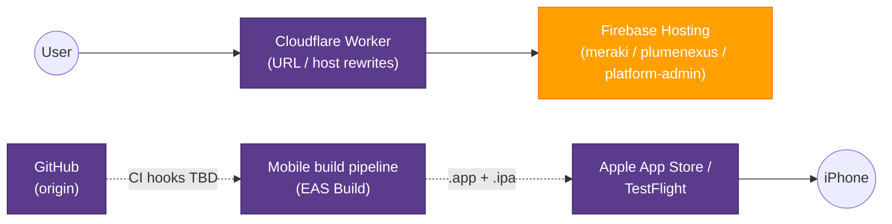

---

## Client surfaces

| Surface | Lives at | Purpose | Auth |
|---|---|---|---|
| **Web PWA** | `meraki-salon-manager.web.app` | Day-to-day admin + tech app | Google sign-in (Firebase Auth) |
| **TipFlow kiosk** | Same domain, kiosk view | Tip-suggestion display at front desk | None (kiosk mode) |
| **Walk-in kiosk** | Same domain | Walk-in waitlist on iPad | None (kiosk mode) |
| **Booking page** | `?book=1` | Public online booking | None |
| **Check-in screen** | `?checkin=<apptId>` | Public client self-check-in | Single-shot HMAC-validated update |
| **Manage appointment** | `?manage=<token>` | Client reschedule/cancel from email link | HMAC token (APPT_MANAGE_SECRET) |
| **RSVP** | `?rsvp=<token>` | Internal meeting RSVPs | UUID token (122 bits) |
| **Unsubscribe** | `?unsub=<token>` | Marketing opt-out | HMAC token (UNSUBSCRIBE_SECRET) |
| **Plume Nexus site** | `plumenexus.com` (target: `plumenexus`) | SaaS marketing + signup | None (public) |
| **Platform admin** | Target: `platform-admin` | Super-admin: list/manage all tenants | Bootstrap admin only |
| **Native mobile** | TestFlight / App Store (TBD) | Tech-facing app: schedule, earnings, clients, chat | Native Google Sign-In + Firebase |

---

## Backend

### Cloud Functions inventory (54 total)

Grouped by purpose:

| Category | Functions |
|---|---|
| **Auth + user lookup** | `getMyTenantRole`, `getTenantMetadata` |
| **Public booking + check-in** | `getPublicAvailability`, `getPublicAppointment`, `findOrCreateClient`, `manageAppointment`, `getApptManageLink` |
| **POS / Stripe** | `createPaymentIntent`, `createCheckoutSession`, `stripeWebhook`, `createMembershipCheckout`, `createMembershipPortal`, `emailMembershipPaymentLink`, `retryGiftCardEmail` |
| **Email (AWS SES)** | `sendApptNotification`, `sendDailyReminders`, `sendTechAppointmentReminders`, `sendReceiptEmail`, `sendReviewRequestEmail`, `sendReviewReceivedNotification`, `sendGiftCardEmail`, `sendChatNotification`, `sendBookingConfirmation`, `sendDirectEmail`, `emailEmployeeInvite`, `sendAccessRequestNotification`, `sesEventWebhook` |
| **SMS (Twilio)** | `sendDirectSms`, `sendSMSCampaign`, Twilio inbound webhook (server-side route) |
| **Marketing** | `sendMarketingCampaign`, `runScheduledCampaigns`, `autoBirthdayCampaign`, `autoLapsedCampaign`, `chatWithMarketing`, `draftConflictMessages` |
| **AI (Anthropic)** | `chatWithReports`, `chatWithSalon`, `chatWithMarketing` (yes, two callables share AI for marketing context) |
| **Meetings / RSVP** | `sendMeetingInvites`, `sendMeetingReminders`, `recordMeetingResponse`, `fetchMeetingForRsvp` |
| **Gusto (payroll)** | `gustoGetAuthUrl`, `gustoOAuthCallback`, `gustoSyncEmployees`, `gustoSubmitPayroll`, `generateAnnual1099s` |
| **Tenant lifecycle** | `createTenantOnboarding`, `listTenants`, `refreshGoogleReviews` |
| **Triggers** | `notifyOnCheckIn` (Firestore onDocumentUpdated), `sendApptNotification` (notifications onCreate) |
| **Unsubscribe** | `processUnsubscribe` |

### Firestore data model (multi-tenant)

```
tenants/{tid}/                              ← Tenant root doc
  ├── data/
  │   ├── settings                          ← Per-tenant settings (staff-readable)
  │   ├── settingsPrivate                   ← Admin-only secrets (Gusto tokens, etc.)
  │   ├── users                             ← Slim role projection (staffEmails/adminEmails)
  │   ├── usersFull                         ← Rich users[] array (admin-only)
  │   └── slides                            ← TipFlow slides
  ├── services/{id}                         ← Service menu
  ├── clients/{id}                          ← Client profiles
  ├── employees/{id}                        ← Public employee data
  │   └── private/comp                      ← Admin-only: SSN, comp, banking
  ├── appointments/{id}                     ← Bookings
  ├── receipts/{id}                         ← POS transactions
  ├── chats/{clientId}                      ← Per-client message thread
  ├── notifications/{id}                    ← Email + push fan-out queue
  ├── userPushTokens/{uid}                  ← Expo push tokens, per user
  ├── giftCards/{id}                        ← Gift card balances
  ├── memberships/{id}                      ← Membership records
  ├── meetings/{id}                         ← Internal meeting docs
  ├── timeOff/{id}                          ← Vacation / sick / personal
  └── logs/{id}                             ← Activity audit log

_oauthNonces/{nonce}                        ← Gusto OAuth state pin (single-use, TTL'd)
```

### Hosting targets

| Target | Site | Source | URL |
|---|---|---|---|
| `meraki` | `meraki-salon-manager` | `dist/` (web app build) | `meraki-salon-manager.web.app` |
| `plumenexus` | `plumenexus` | `plumenexus/dist/` (marketing site) | `plumenexus.com` |
| `platform-admin` | Hostname TBD | `platform-admin/dist/` (super-admin console) | TBD |

Deploys via `firebase deploy --only hosting:meraki` etc. Staging via Firebase Hosting Channels (`deploy:staging` → `promote:staging`).

---

## Multi-tenant architecture

The single Firebase project (`meraki-salon-manager`) serves N tenants. Each tenant = one salon. The same SPA bundle is deployed once and serves all tenants; tenant identity is resolved at runtime from the request's hostname. Data isolation is enforced by Firestore security rules; cross-tenant operations go through the `requireTenantStaff` / `requireTenantAdmin` helpers and the `forEachActiveTenant` iterator.

### Tenant data isolation

Every business object lives under `tenants/{tid}/...`. Firestore rules block cross-tenant reads — a user authenticated as a staff member of tenant `meraki` cannot read tenant `demo`'s clients or appointments.

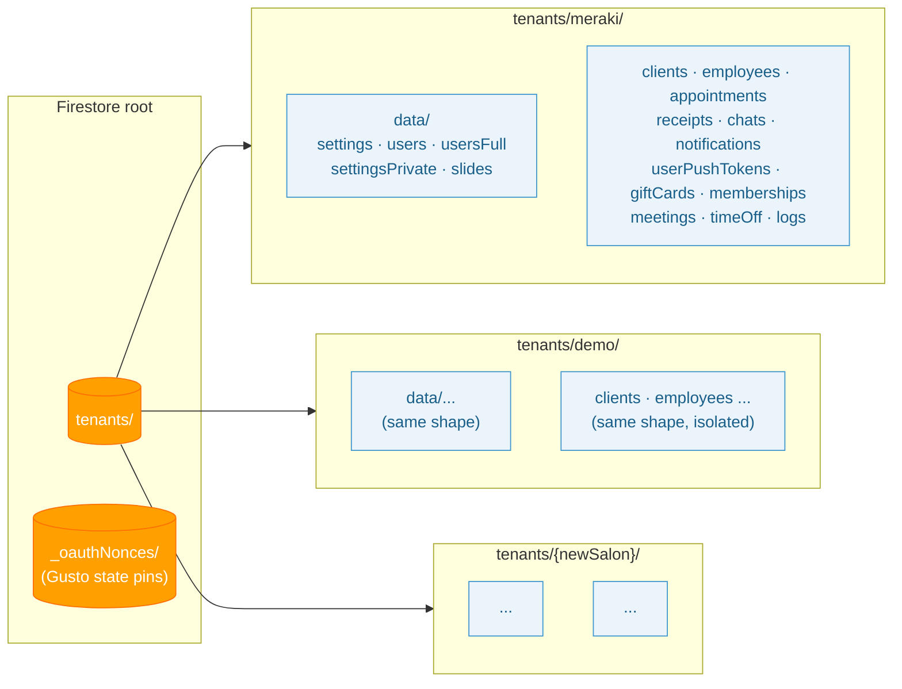

### Request routing — how a subdomain becomes a tenant

Tenant resolution happens client-side in [`src/lib/tenant.js`](src/lib/tenant.js). Order of precedence:

1. `?tenant=<id>` query param (test override, persists in sessionStorage)
2. `import.meta.env.VITE_TENANT_ID` build-time env (staging only)
3. `window.location.hostname` subdomain match
4. Fallback to `'meraki'` (legacy default)

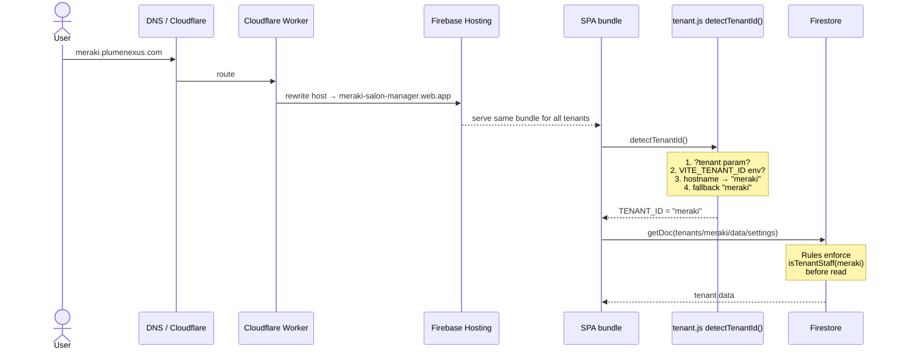

### Per-tenant branding (dual-store)

Two stores; admin UI dual-writes so public surfaces and auth surfaces stay in sync. Eventual consolidation is open work.

| Store | Path | Audience | Holds |
|---|---|---|---|
| `data/settings` | `tenants/{tid}/data/settings` | Staff-only (rules-blocked pre-login) | `salonName`, `brandName`, `brandTagline` + everything else |
| `data/webfront` | `tenants/{tid}/data/webfront` | Public read | Branding (mirrored) + `address`, `phone`, `instagram`, `hours` |

**Resolution chain in client code:**

```
authenticated context: settings.salonName → webfront.salonName → "Plume Nexus"
public  context (booking, check-in, kiosk, splash):
                          webfront.salonName → tenant root doc .name → "Plume Nexus"
```

### Cross-tenant operations

Three categories of code legitimately traverse tenants. All use Admin SDK (bypasses Firestore rules) AND verify caller authorization in code.

```mermaid
graph TB
    subgraph Cron["Scheduled / cron jobs"]
        CronFn["sendDailyReminders<br/>autoBirthdayCampaign<br/>autoLapsedCampaign<br/>sendTechAppointmentReminders<br/>generateAnnual1099s (TODO)<br/>runScheduledCampaigns"]
        ForEach["forEachActiveTenant(label, cb, { skipPaused? })"]
        CronFn --> ForEach
        ForEach --> AllTenants[("for each tenant<br/>in tenants/*")]
    end

    subgraph Triggers["Doc triggers"]
        TrigFn["notifyOnCheckIn<br/>sendApptNotification<br/>... 9 total"]
        TrigPath["match path:<br/>tenants/{tenantId}/.../{id}<br/>→ event.params.tenantId"]
        TrigFn --> TrigPath
    end

    subgraph Callables["Callable functions"]
        CallFn["chatWithSalon<br/>chatWithReports<br/>createPaymentIntent<br/>createTenantOnboarding<br/>refreshGoogleReviews<br/>... 30+"]
        CallGate["validate tenantId regex<br/>requireTenantStaff/Admin(db, tid, request)"]
        CallFn --> CallGate
    end

    subgraph PlatAdmin["Platform admin console"]
        PA["listTenants callable<br/>(bootstrap admin only)"]
        PAList[("read across<br/>tenants/*")]
        PA --> PAList
    end

    classDef firebase fill:#FFA000,stroke:#FF6F00,color:#fff
    classDef rule fill:#fef3c7,stroke:#92400e,color:#92400e
    class CronFn,TrigFn,CallFn,PA,AllTenants,TrigPath,PAList firebase
    class ForEach,CallGate rule
```

### Tenant lifecycle — signup to active

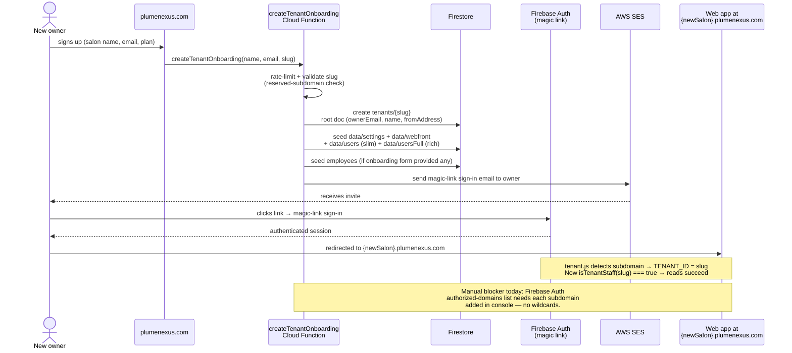

### Feature flags + canary rollouts

New features ship behind a flag in [`src/lib/featureFlags.js`](src/lib/featureFlags.js) and roll out progressively through canary tiers. Same code is deployed to everyone in a single `npm run promote:staging`; only the flag flips per tier control who actually sees the new behavior.

**Resolution chain** (highest priority wins):

1. **Per-tenant override** — `tenants/{tid}/data/settings.featureFlags[name]`. Used for emergency rollback (`false`) or early-access for a paying tenant (`true`).
2. **Tier default** — `FEATURE_TIER_DEFAULTS[name][tier]` from source code.
3. **Global default** — `false`. Features are OFF unless explicitly enabled.

**Canary tiers** (in order, lowest stakes to highest):

| Tier | Use | Audience |
|---|---|---|
| `demo` | First canary — synthetic data, no real money at stake | `demo.plumenexus.com` |
| `owner` | Second canary — Jonathan's own salon | Meraki |
| `free` | Solo / starter free tier | Default for new self-service signups |
| `pro` | Paid tier | Paying tenants on the Pro plan |
| `enterprise` | Custom-contract tier | Large salons / chains |

**Standard rollout cadence:**

1. Land code behind a flag with `{ demo: true }` only (everyone else implicit false).
2. Deploy via `promote:staging`. Soak on `demo.plumenexus.com` for 1-3 days.
3. Flip `owner: true`. Deploy. Soak on Meraki for 3-7 days.
4. Flip `free: true`. Soak 7-14 days.
5. Flip `pro` and `enterprise` to true.
6. After ≥2 weeks at 100% with no issues, **remove the flag** and inline the feature. Flags that linger become tech debt.

**Tenant override examples** (use `data/settings.featureFlags`):

```js
// "Emergency: turn off the new checkout for tenant X while we debug"
tenants/{tid}/data/settings.featureFlags = { newCheckoutFlow: false }

// "Pro tenant Y bought early-access to the AI scheduling beta"
tenants/{tid}/data/settings.featureFlags = { aiScheduling: true }
```

**Rollback patterns:**

| Scenario | Action |
|---|---|
| Bug found in new feature, but old code is fine | Edit `FEATURE_TIER_DEFAULTS` → set the bad feature's tier(s) back to `false` → deploy. Code stays; flag flips. |
| Bug in the new code path that affects all features | `npm run rollback:console` → Firebase Hosting → revert release. |
| Bug affects only ONE tenant | Write `featureFlags.{name}: false` on that tenant's `data/settings`. Instant — no deploy. |

### Tenant identity matrix

Quick reference for "where is tenant id known and how":

| Layer | Where tenant comes from | Notes |
|---|---|---|
| **Web bundle** (browser) | `detectTenantId()` — query param > env > hostname | Pinned at first call; cached in `TENANT_ID` const |
| **Cloud Function callable** | `request.data.tenantId` (client-supplied) | Server validates format + calls `requireTenantStaff/Admin` |
| **Cloud Function trigger** | `event.params.tenantId` from path wildcard | Implicit — Firestore path encodes it |
| **Cron job** | Iterates `tenants/*` via `forEachActiveTenant` | Skips `active: false`, optionally skips paused tenants |
| **Mobile app** | Hardcoded `'meraki'` in `mobile/src/lib/firebase.js` | Single-tenant for now; mobile multi-tenant is future work |

### Multi-tenant gotchas

See [`reference_firebase_quirks.md`](memory) for the full list. Summary:

- **Auth domains aren't wildcardable.** Each tenant subdomain must be added to Firebase Auth → Settings → Authorized domains manually. Plan to automate inside `createTenantOnboarding` (TODO).
- **Cloudflare proxy can break Firebase SSL.** Plumenexus subdomains must be DNS-only (gray cloud), not proxied — otherwise SSL handshake fails on Firebase's side.
- **Tenant root doc must exist for cron fan-out.** Meraki's `tenants/meraki` doc was missing for ~24hr because the schema predated SaaS; scheduled functions silently no-op'd. New tenants via `createTenantOnboarding` get the doc; legacy tenants need `scripts/set-meraki-from-address.cjs` style backfill.
- **`SalonWebfront.jsx` is still Meraki-templated.** Tenant #2 needs a refactor pass before they can use the public booking surface.

---

## Third-party integrations

| Provider | Purpose | Where wired | Env vars / secrets | Account owner |
|---|---|---|---|---|
| **Stripe** | POS PaymentIntents · subscriptions · webhooks | `createPaymentIntent`, `createMembershipCheckout`, `stripeWebhook` | `STRIPE_SECRET_KEY` (secret), `STRIPE_WEBHOOK_SECRET` (secret), `STRIPE_PRO_PRICE_ID`, `STRIPE_STARTER_PRICE_ID` | Jonathan |
| **Twilio** | SMS send + inbound webhook | `sendDirectSms`, `sendSMSCampaign`, `twilioInboundSms` | `TWILIO_AUTH_TOKEN` (secret), `TWILIO_ACCOUNT_SID`, `TWILIO_API_KEY_SID`, `TWILIO_FROM` | Jonathan |
| **AWS SES** | All transactional + marketing email | All `send*Email` functions (via `sendEmail()` abstraction) | `AWS_ACCESS_KEY_ID`, `AWS_SECRET_ACCESS_KEY`, `AWS_SES_REGION`, `AWS_SES_CONFIG_SET`, `AWS_SES_SHARED_IDENTITY_ARN` | Jonathan |
| **Gusto** | Payroll OAuth + submit + 1099s | `gustoOAuthCallback`, `gustoSubmitPayroll`, etc. | `GUSTO_CLIENT_ID`, `GUSTO_CLIENT_SECRET`, `GUSTO_REDIRECT_URI` | Jonathan |
| **Anthropic** | Reports chatbot · voice command parsing | `chatWithReports`, `chatWithSalon`, `chatWithMarketing`, `voiceCommand` | `ANTHROPIC_API_KEY` (secret) | Jonathan |
| **Google Cloud** | OAuth (web + iOS clients) · Maps API · Firebase | Firebase Console + Cloud Console | `GOOGLE_MAPS_API_KEY`, OAuth client IDs in mobile app source | Jonathan |
| **Expo / EAS** | Mobile build pipeline · push fan-out | `mobile/`, `sendApptNotification` (push fan-out) | EAS project ID in `mobile/app.json` | Jonathan (`@jvankim`) |
| **Apple Developer** | App Store distribution | EAS Build signing | Pending verification as of 2026-05-10 | Jonathan |
| **Cloudflare Worker** | URL / host rewrites | `cloudflare/worker.js`, deployed via `wrangler` | Cloudflare account creds | Jonathan |
| **GitHub** | Origin · code hosting | `vankimj/Meraki-Salon-Manager` | — | Jonathan |
| **GlossGenius** | CSV importer (one-way) | Admin → Import from GlossGenius | None (manual CSV) | — |
| **ngrok** | Dev tunnel for Expo only | `mobile/` dev | Local install only | — |

---

## Data flow walkthroughs

### 1. Online booking → confirmation → reminder

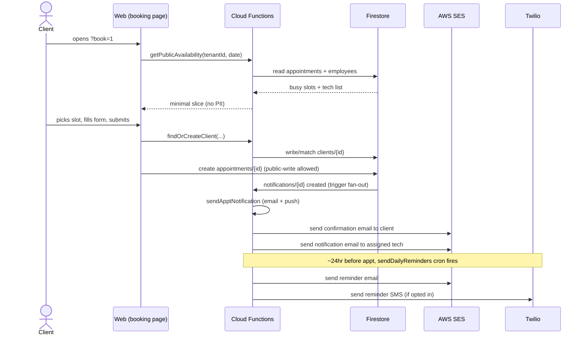

### 2. Tech checks in client → tech notification (push + email)

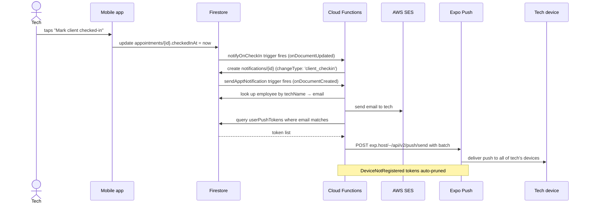

### 3. POS checkout → receipt → payroll

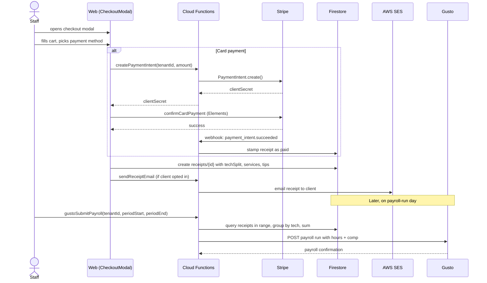

### 4. Marketing campaign — SMS send

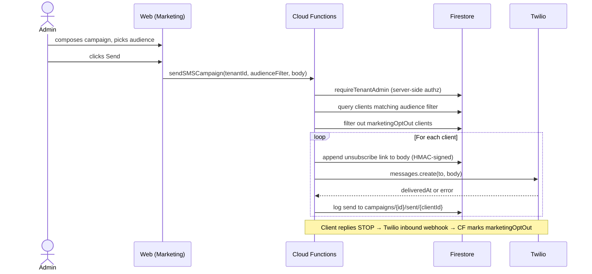

### 5. New tenant onboarding (SaaS signup)

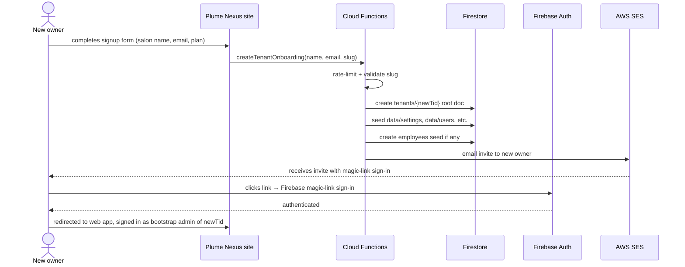

---

## Secrets & environment

### Stored in Cloud Secret Manager (defineSecret)

These are NEVER plaintext in `.env` — overlap with secret env vars would fail deploy. Set via:

```bash
firebase functions:secrets:set <NAME>
```

| Name | Used by |
|---|---|
| `UNSUBSCRIBE_SECRET` | HMAC-sign + verify unsubscribe links |
| `APPT_MANAGE_SECRET` | HMAC-sign + verify appointment-manage links |
| `STRIPE_SECRET_KEY` | All Stripe API calls |
| `STRIPE_WEBHOOK_SECRET` | Verify Stripe webhook signatures |
| `TWILIO_AUTH_TOKEN` | Twilio API auth + signature-verify inbound webhook |
| `ANTHROPIC_API_KEY` | Reports chatbot, voice command, marketing AI |

### Stored in `functions/.env` (defineString — non-secret config)

| Name | Used for |
|---|---|
| `AWS_ACCESS_KEY_ID` / `AWS_SECRET_ACCESS_KEY` | SES SendEmail + SES Tenants IAM creds (worth promoting to defineSecret eventually) |
| `AWS_SES_REGION` | SES region (currently `us-west-2`) |
| `AWS_SES_CONFIG_SET` | Configuration Set for bounce/complaint event routing to SNS |
| `AWS_SES_SHARED_IDENTITY_ARN` | Sending identity ARN (`send.plumenexus.com`) associated to each tenant's SES Tenant |
| `GOOGLE_MAPS_API_KEY` | Address autocomplete in client/employee forms |
| `PUBLIC_APP_URL` | Default unsubscribe + manage-appt link base |
| `TWILIO_ACCOUNT_SID`, `TWILIO_API_KEY_SID`, `TWILIO_FROM` | Twilio config |
| `STRIPE_PRO_PRICE_ID`, `STRIPE_STARTER_PRICE_ID` | Stripe pricing for self-service signup |
| `GUSTO_CLIENT_ID`, `GUSTO_CLIENT_SECRET`, `GUSTO_REDIRECT_URI` | Gusto OAuth |

---

## Failure modes

What breaks when each integration is down, and what the user sees:

| Provider down | Visible impact | Mitigation in place |
|---|---|---|
| **Firebase Auth** | Nobody can sign in | None — Firebase Auth uptime is Google's SLA |
| **Firestore** | Entire app broken — nothing loads | None |
| **Cloud Functions** | Callables fail; emails/SMS queue but don't fire | Firestore writes (notifications/{id}) buffer until functions return |
| **Stripe** | POS card payments fail; cash/check still work | Cash fallback always available |
| **Twilio** | SMS fails (campaigns + reminders); email reminders still go | Email reminders are primary channel |
| **AWS SES** | Email fails (receipts + reminders + notifications) | Notifications doc stays unsent for retry; admin sees `error` field. Persistent failures get added to per-tenant suppression list via `sesEventWebhook` |
| **Gusto** | Payroll submit fails | Admin reverts to running payroll manually in Gusto's own UI |
| **Anthropic** | Reports chatbot returns "AI unavailable"; voice command falls back to manual entry | Non-AI Reports still work; voice is optional |
| **Expo Push** | Mobile alerts don't deliver; email notifications still go | Email is primary, push is secondary |
| **Cloudflare Worker** | Some URL/host rewrites fail | Plume Nexus marketing site uses direct Firebase Hosting |
| **GlossGenius** | (only matters during one-time migration) | Manual CSV re-export |

---

## Deploy targets reference

| Action | Command |
|---|---|
| Web staging | `npm run deploy:staging` |
| Web production | `npm run promote:staging` (re-builds, doesn't clone — required) |
| Single function | `firebase deploy --only functions:<fnName>` |
| All functions | `firebase deploy --only functions` |
| Firestore rules | `firebase deploy --only firestore:rules` |
| Hosting target | `firebase deploy --only hosting:<target>` |
| Plume Nexus site | `firebase deploy --only hosting:plumenexus` |
| Platform admin | `firebase deploy --only hosting:platform-admin` |
| Mobile dev client | `cd mobile && eas build --profile development --platform ios` |
| Mobile sim build | `cd mobile && eas build --profile development-simulator --platform ios` |
| Mobile production | `cd mobile && eas build --profile production --platform ios` |
| Mobile App Store submit | `cd mobile && eas submit --platform ios` |
| Cloudflare Worker | `cd cloudflare && wrangler deploy` |

---

## Customer-data recovery runbook

Five layers protect customer data, each with a different recovery use case. Pick the **lowest-effort** layer that can produce the state you need.

### Quick reference — "I need to recover X"

| Scenario | Layer to reach for | RTO |
|---|---|---|
| Admin accidentally deleted a single client/appointment/receipt/employee | Soft-delete tombstone (Layer 3) — restore via Admin UI | Seconds |
| Admin edited the wrong field on a single doc; need previous version | Per-doc BigQuery restore (Layer 5) — ⏳ History button in detail modal | <1 minute |
| `data/usersFull` went missing entirely (the May 10 incident) | Auto-heal on next admin load (Layer 2) | Automatic, seconds |
| Bulk collection corruption / wipe (last 7 days) | PITR (Layer 4) — full database point-in-time restore | 5-15 min |
| Bulk corruption from 8-30 days ago | Daily Firestore snapshot (Layer 4.5) — `gcloud firestore import` | 10-30 min |
| Need state older than 30 days for a tracked collection | BigQuery raw changelog (Layer 5) — query, reconstruct, write back | Hours |
| Want to see what changed when (no restore needed) | BigQuery forensic log — query `firestore_export.*_raw_changelog` | Read-only |

### Layer 1 — Atomic writes (prevent, not recover)

Every multi-doc save is committed via `writeBatch().commit()`. Either every doc commits or none does. Eliminates the "partial state" failure mode that hit `data/usersFull` on 2026-05-10.

**Code paths:** `saveUsers`, `ensureStaffEmailsBackfill`, `saveEmployee`, `createEmployee` in `src/lib/firestore.js`; `createTenantOnboarding`, `gustoOAuthCallback`, `getGustoCredentials` migration in `functions/index.js`.

**Nothing to invoke manually** — this layer is preventive.

### Layer 2 — `healUsersFullIfMissing` auto-heal

Runs automatically on every admin login. Detects "slim projection has staff emails, but `data/usersFull` is missing/empty" and rebuilds losslessly from BigQuery (`recoverUsersFullFromBQ` Cloud Function) — preserves real timestamps, custom names, all per-record metadata. Falls back to lossy reconstruction from `staffEmails` only if BQ has no snapshot (e.g. brand-new tenant with no realtime writes since extension install).

**Code path:** `healUsersFullIfMissing` in `src/lib/firestore.js`, called from `AppContext.checkUserAccess`.

**Invoke manually if needed:** sign out and sign back in as a tenant admin; the function fires automatically. Console line: `[healUsersFullIfMissing] LOSSLESS recovery via BigQuery snapshot @ <iso>`.

### Layer 3 — Soft-delete tombstones

User-initiated deletes on 15 customer-data-adjacent collections write `{ _deleted: true, _deletedAt, _deletedBy }` instead of removing the doc. Live for 30 days, then the `purgeOldTombstones` cron purges them at 3am ET.

**Collections covered:** clients, appointments, receipts, memberships, giftCards, services, employees, bonuses, membershipPlans, timeOff, promoCodes, reviews, meetings, products, campaigns.

**To restore an accidentally-deleted record:**

1. **You know the doc ID** → open the detail view, click "⏳ History", pick the snapshot before the deletion, click Restore. The restore strips `_deleted/_deletedAt/_deletedBy` and writes a `_restoredFrom: bigquery@<iso>` marker.
2. **You don't know the doc ID** → use the "Recently deleted" tab in Admin → Users *(once Task 4 ships)*. Or, as a fallback, find the tombstone by hand: Firestore Console → tenant collection → filter `_deleted == true`, then call `restoreDocFromBQ` from a script.

**One-off script:** `scripts/restore-meraki-users.cjs` is the template — read both sides of a split, union the surviving signal with canonical mappings, write back atomically with `_healed: true` markers for forensics.

### Layer 4 — Point-in-Time Recovery (PITR)

Firestore retains every write at 1-microsecond granularity for **7 days**. Restores the entire database (or specific collections) to any past timestamp into a NEW database — you then migrate or swap.

**When to use:** bulk corruption, ransomware-style scenarios, "everything looks wrong, roll back to 30 minutes ago." Not for single-doc work (use Layer 3/5 instead).

**How to restore:**

```bash
# Verify PITR is enabled
gcloud firestore databases describe --database='(default)' --project=meraki-salon-manager --format='value(pointInTimeRecoveryEnablement)'
# Should print: POINT_IN_TIME_RECOVERY_ENABLED

# CLONE (NOT `restore` — that's for managed backups) to a new database
# at any point-in-time within the 7-day window. Snapshot-time MUST be on
# an exact minute boundary (no seconds component).
gcloud firestore databases clone \
  --source-database='projects/meraki-salon-manager/databases/(default)' \
  --snapshot-time='2026-05-12T10:00:00.000Z' \
  --destination-database=restore-YYYYMMDD \
  --project=meraki-salon-manager

# Async — returns immediately with an Operation. Poll with:
gcloud firestore operations list --database=restore-YYYYMMDD --project=meraki-salon-manager
```

**Timing** — verified by drill (2026-05-30, restoring 1h-ago snapshot of full prod DB ~500MB): **~11 minutes** end-to-end (database create + clone + verify). Counts matched prod exactly.

Then either point the app at the new database (env var) or use `gcloud firestore export` + import to move the data into a recovered version of `(default)`. Coordinate with users — the swap window has visible read inconsistency.

**Cost:** $0.18/GB/month for the PITR overlay. At Meraki's volume (~500MB), pennies per month.

### Layer 4.5 — Daily Firestore snapshots (8-30 day window)

Once per day Firestore writes a full backup of the `(default)` database to managed storage, retained for 30 days. Covers the gap between PITR (7-day window) and BigQuery (only 5 collections), with **referentially-consistent point-in-time of every collection** (settings, gift cards, promo codes, tenant root docs, slugs, suppression — everything PITR covers, but going back 30 days).

**Schedule:**
```
projects/meraki-salon-manager/databases/(default)/backupSchedules/95f8ce3d-6d3e-4dc8-8ca2-aa4bee43e8b9
  recurrence: daily
  retention: 30 days (2592000s)
  first run: ~2026-05-30 (24h after creation)
```

**When to use:**
- The data was correct 14 days ago but is wrong now, and PITR's 7-day window can't reach back that far
- You need referential consistency across collections (BQ can't give that — it only has per-collection changelogs)
- Bulk wipe of a collection NOT in BQ mirror (settings, automationSent, payrollRuns, etc.)

**How to verify the schedule is still firing:**
```bash
# Lists all snapshots in the last 30 days. Should grow by 1 per day.
gcloud firestore backups list --location=us-central1 --project=meraki-salon-manager
```

**How to restore:**
```bash
# 1. List backups to find the one you want
gcloud firestore backups list --location=us-central1 --project=meraki-salon-manager \
  --format='table(name,snapshotTime,state)' --sort-by=snapshotTime

# 2. Copy the backup name (last segment after backups/)
BACKUP=projects/meraki-salon-manager/locations/us-central1/backups/XXXX-XXXX-XXXX

# 3. Restore into a NEW database (NEVER restore over (default) — there is no undo)
gcloud firestore databases restore \
  --source-backup=$BACKUP \
  --destination-database=restore-YYYYMMDD \
  --project=meraki-salon-manager

# 4. Verify by querying a known record
gcloud firestore documents describe \
  "projects/meraki-salon-manager/databases/restore-YYYYMMDD/documents/tenants/tf46226a93a1b546b/data/settings"

# 5. To swap into prod, EXPORT from restore db and IMPORT into (default), then delete restore-YYYYMMDD
gcloud firestore export gs://meraki-restore-staging --database=restore-YYYYMMDD --project=meraki-salon-manager
gcloud firestore import gs://meraki-restore-staging/<export-folder> --database='(default)' --project=meraki-salon-manager
gcloud firestore databases delete restore-YYYYMMDD --project=meraki-salon-manager
```

**⚠ Critical safety rules:**
- ALWAYS restore to a new database first. `gcloud firestore databases restore` to `(default)` is irreversible.
- The restore window is visible to users — Cloud Functions still fire, but reads briefly see inconsistency. Schedule the swap during low-traffic hours.
- Daily snapshots are managed (you can't browse them in GCS); use `gcloud firestore backups list/describe/restore`.

**Cost:** Backup storage is roughly $0.05/GB/month × 30 days × data size. At Meraki's ~500MB → ~$0.30/month total.

**Untested backup = no backup.** Do a recovery drill at least once before launch — restore the most recent snapshot to a side database and verify document counts match prod ± 1 day of writes.

### Layer 5 — BigQuery forensic log + per-doc lossless restore

Every change to clients / appointments / receipts / employees / `tenants/{id}/data` is mirrored to BigQuery within ~5 seconds and retained **forever** (until manually deleted from BQ). This is the lossless source for both `recoverUsersFullFromBQ` and per-doc restore in the UI.

**Tables:**
```
meraki-salon-manager.firestore_export.clients_raw_changelog
meraki-salon-manager.firestore_export.appointments_raw_changelog
meraki-salon-manager.firestore_export.receipts_raw_changelog
meraki-salon-manager.firestore_export.employees_raw_changelog
meraki-salon-manager.firestore_export.data_raw_changelog
```

**Per-doc UI restore:** every detail modal (Clients, Schedule appointments, Reports receipts, Employees) has a ⏳ History button for admins. Lists last 20 CREATE/UPDATE snapshots with collection-aware previews. Pick one, click Restore — full-doc replacement via `restoreDocFromBQ` callable.

**Forensic query — "show me everything that happened to this client":**
```sql
SELECT timestamp, operation, JSON_EXTRACT(data, '$.notes') AS notes
FROM `meraki-salon-manager.firestore_export.clients_raw_changelog`
WHERE document_name = 'projects/meraki-salon-manager/databases/(default)/documents/tenants/meraki/clients/CLIENT_ID'
ORDER BY timestamp ASC
```

**Gotcha:** backfill `IMPORT` rows have `path_params: null` (only realtime triggers populate the wildcard binding). Filter on `document_name` LIKE patterns, NOT on `JSON_EXTRACT_SCALAR(path_params, '$.tenantId')`, or you'll silently miss every backfilled row.

### Defense-in-depth at a glance

| Layer | Coverage | Cost | RTO |
|---|---|---|---|
| 1. writeBatch atomicity | Every split-doc write | $0 (built-in) | N/A (preventive) |
| 2. Auto-heal on load | `data/usersFull` only | $0 | <1s |
| 3. Soft-delete tombstones | 15 customer-data collections, 30-day window | $0 storage delta | Seconds (admin click) |
| 4. PITR | Whole database, 7-day window | ~$0.10/mo | 5-15 min manual |
| 4.5. Daily Firestore snapshots | Whole database, 30-day window | ~$0.30/mo | 10-30 min manual |
| 5. BQ mirror | 5 collections + `data` subcoll, forever | ~$0.20/mo | <1 min per doc |

### Recovery escalation order

If you don't know which layer to reach for, follow this:

1. **Is it ONE specific doc?** → Layer 5 (⏳ History button in the UI)
2. **Is the doc itself missing entirely?** → Check the tombstone first (Layer 3 — Recently Deleted), then BQ snapshot (Layer 5)
3. **Did `data/usersFull` go missing?** → Don't do anything; sign in, Layer 2 self-heals
4. **Is more than a single collection wrong, last 7 days?** → PITR (Layer 4)
5. **Is more than a single collection wrong, 8-30 days old?** → Daily Firestore snapshot (Layer 4.5)
6. **Older than 30 days, and the collection is in BQ mirror?** → BigQuery raw changelog (Layer 5 forensic query)
7. **Older than 30 days, not in BQ mirror?** → Accept the loss. Document for next time.

**Don't reach for PITR for single-doc work** — it restores to a new database. Use the per-doc ⏳ History instead.

### Phone-a-friend

- Founder: jvankim@gmail.com — the only account in `ALLOWED_EMAILS` allowlist
- All restore callables require `requireTenantAdmin` (tenant admin OR tenant ownerEmail on parent doc)
- Firebase Console direct edits: avoid except as last resort — they bypass writeBatch atomicity and won't trigger the BQ mirror's onWrite trigger

---

## Per-tenant cost dashboard

Two crons + a logging library write per-tenant cost data that the
platform-admin console (`admin.plumenexus.com`) renders as a stacked-area
chart per tenant and a horizontal bar chart across tenants.

### Pipeline

```
Outbound call → lib/usage.js logs raw event → nightly aggregator → admin UI

Twilio messages.create()   → tenants/{id}/usageSms/{auto}   ┐
SES   SendEmailCommand     → tenants/{id}/usageEmail/{auto} ├─→ 03:00 UTC ─→ tenants/{id}/usageDaily/{YYYY-MM-DD}
Anthropic messages.create() → tenants/{id}/usageAi/{auto}    ┘                ↓
                                                              tenants/{id}/usageMonthly/{YYYY-MM}
BQ billing export → 02:00 UTC pullGcpCostDaily ─→ platform/gcpCost/daily/{day}
                                                  ↓
                                                  platform/usage/daily/{day}
                                                  platform/usage/monthly/{month}
```

### Cost components

| Component | Source | Pricing (constants in `lib/usage.js`) |
|---|---|---|
| **Twilio SMS** | Per segment, logged at send | `$0.0083 / segment` (US TFN) |
| **TFN rental** | Per active TFN per tenant | `$2.00 / month` → `$0.0667/day` |
| **AWS SES** | Per email, logged at send | `$0.0001 / send` |
| **Anthropic AI** | Input + output tokens | `$1/MTok input`, `$5/MTok output` (Haiku 4.5) |
| **GCP / Firebase** | BQ billing export, allocated by activity share | Daily total ÷ Σ active users × tenant.userCount |

### Files

- [`functions/lib/usage.js`](functions/lib/usage.js) — `logSmsUsage`, `logEmailUsage`, `logAiUsage`, `PRICING`
- [`functions/index.js`](functions/index.js) (`pullGcpCostDaily`, `aggregateUsageDaily`, `runUsageAggregatorForDay`)
- [`platform-admin/src/lib/cost.js`](platform-admin/src/lib/cost.js) — read helpers
- [`platform-admin/src/components/CostChart.jsx`](platform-admin/src/components/CostChart.jsx) — recharts area + bar charts

### One-time GCP setup (for GCP cost line to populate)

1. **Enable BQ billing export.** GCP Console → Billing → Billing export → Daily cost detail → choose a BQ dataset.
2. **Grant BQ Data Viewer to the Functions SA.** IAM → grant `roles/bigquery.dataViewer` on the billing dataset to `meraki-salon-manager@appspot.gserviceaccount.com`.
3. **Set env params.** Add to `functions/.env` (these are `defineString` params, not secrets):
   ```
   GCP_BILLING_BQ_PROJECT=<projectId>
   GCP_BILLING_BQ_DATASET=billing_export
   GCP_BILLING_BQ_TABLE=gcp_billing_export_v1_<billingAcctSuffix>
   ```
   Then redeploy: `firebase deploy --only functions:pullGcpCostDaily`
4. **Manual back-fill (optional).** Call `runUsageAggregatorForDay` from the platform-admin console for each historical day once data is available.

### Security model

- Raw `usageSms/usageEmail/usageAi` docs: tenant admin only (last-4 phone / local-prefix email = weak per-customer signal).
- Aggregated `usageDaily/usageMonthly`: tenant admin OR platform admin (pure aggregate numbers, no per-customer signal — same standard as `getTenantMetadata`).
- `platform/usage/*` + `platform/gcpCost/*`: platform admin only.
- All writes server-side only via admin SDK; clients can't forge usage docs.

### Known limitations

- Stripe processing fees (2.9% + $0.30) are the **salon's** cost, not Plume Nexus's — not included.
- The marketing-site chatbot (`chatWithMarketing`) has no tenant attribution; its Anthropic cost falls into the GCP/platform overhead pool.
- GCP allocation uses `userCount` as activity proxy (cheap, single doc/tenant). A tenant with 1 user and very heavy reads will be under-allocated. Revisit if a tenant disputes their share.
- Pricing constants live in `lib/usage.js` — update there + redeploy when rates change.

---

## Versioning

This doc is checked into `main`. Update it when:

- A new third-party integration is added or removed
- The Firestore tenant model gets a new root collection
- A new hosting target is created
- The deploy workflow changes
- A new failure mode is discovered (with mitigation)

Last updated: 2026-05-31.
